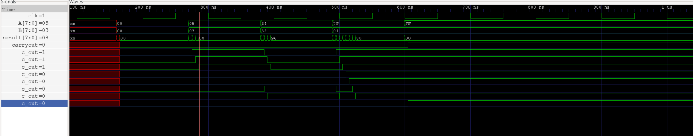

# Lab 5 — Adders

**Name:** Marlon Lopez

**Email:** mlope589@ucr.edu

## Test Cases

### Group 1 — Addition Behavior Verification (8-bit)

| #   | Test     | Expected                   |
| --- | -------- | -------------------------- |
| 1.1 | 0 + 0    | result = 0, carryout = 0   |
| 1.2 | 5 + 3    | result = 8, carryout = 0   |
| 1.3 | 100 + 50 | result = 150, carryout = 0 |
| 1.4 | 127 + 1  | result = 128, carryout = 0 |
| 1.5 | 255 + 1  | result = 0, carryout = 1   |

### Group 2 Increasing Number of Bits

| #   | Width  | Expected                 | Result |
| --- | ------ | ------------------------ | ------ |
| 2.1 | 16-bit | result = 0, carryout = 1 | passes |
| 2.2 | 32-bit | result = 0, carryout = 1 | fails  |
| 2.3 | 64-bit | result = 0, carryout = 1 | fails  |

### Prediction

Each full adder adds about 5 ns of carry delay. This means an N-bit ripple-carry adder takes about 5N ns to settle.

For 16 bits:

16 × 5 ns = 80 ns
Which fits inside the 100 ns limit, so it should pass.

For 32 bits:

32 × 5 ns = 160 ns

Which is outside of 100 ns so it should fail. 

Where my sims matched my predicition. The 16-bit test passed, while the 32-bit and 64-bit tests failed.

## Waveform

The ripple is clearest during the 255 + 1 test around 540 ns.

A changes to 0xFF while B stays at 0x01. This forces the carry to move through all 8 bits.

The carry-out signals change one after another instead of at the same time. Each stage is delayed by about 5 ns.

The result briefly changes before settling to 0x00, and the final carryout becomes 1 only after the last bit settles. This delay grows with larger adders, which is why the 32-bit and 64-bit tests fail within 100 ns.